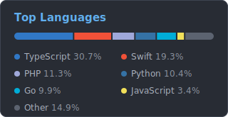
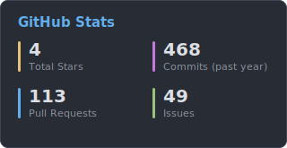

# Hi there 👋 I'm Hiroki Yamada

Software engineer based in Japan 🇯🇵

- 📱 Building mobile apps with **Flutter** and **Swift**
- 💻 Web development with **TypeScript / React / Next.js** and **Go**

## 🛠 Tech Stack

<!-- ordered by actual bytes written across my repositories (2026-07 snapshot) -->

## 📊 GitHub Stats

<!-- self-hosted cards: regenerated daily by .github/workflows/update-stats.yml -->

  
  

